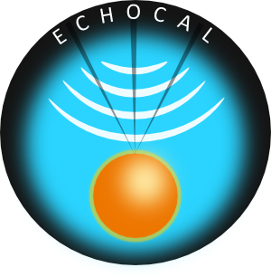
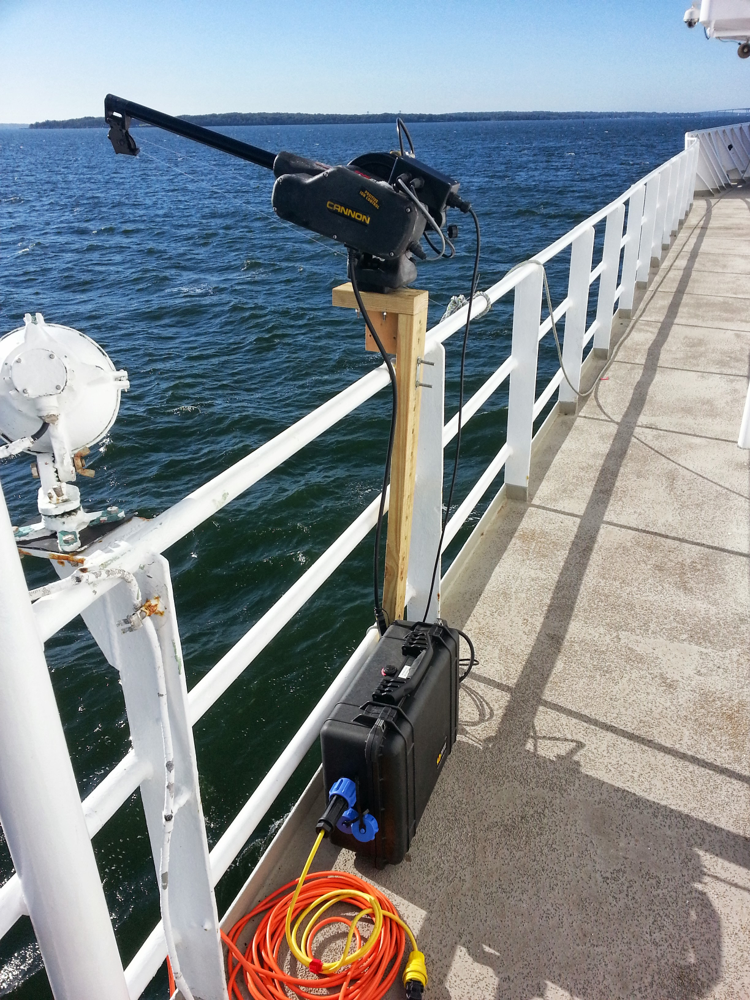
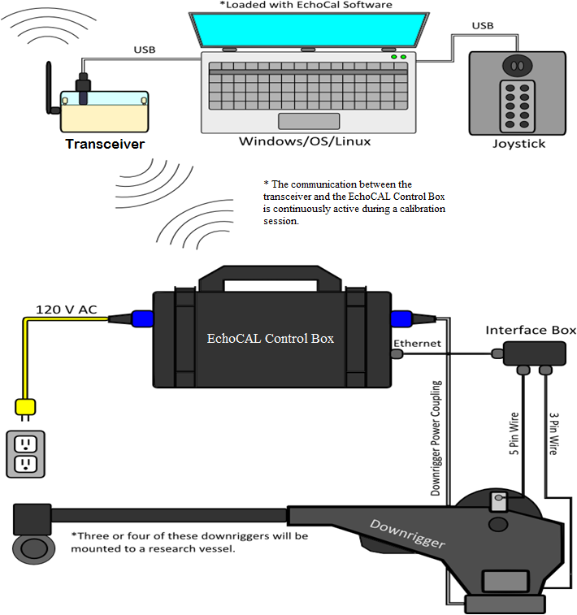

# EchoCAL: A Wireless Echosounder Calibration System. 

The EchoCAL Wireless Echosounder Calibration System was designed to give Ocean Acoustics researchers the ability to control motorized downriggers remotely during scientific echosounder calibrations. A typical downrigger station consists of a control box wired to a Canon downrigger which is mounted on the railing of the research vessel. A typical calibration on a research vessel requires at least three downrigger stations. (Two on one side of the vessel, and one on the other side.)

The reseacher can control these downriggers wirelessly from inside the vessel. (See the figure below for a system diagram.)

## EchoCAL Project Files:

The following folders contain the required documentation to build one EchoCAL system:

### DesignFiles:

This folder contains a parts list as well as wiring diagrams for all EchoCAL hardware. This folder has two subfolders, "CircuitCard" and "WiringDiagrams". The "CircuitCard" folder contains the design files to manufacture the EchoCAL custom printed circuitboard (PCB). The "WiringDiagram" folder contains CAD, DXF, and PDF drawings for building all of the hardware for EchoCAL.

### Documentation:

This folder has the Software/Firmware Installation Manuals and the User Manuals.

### EchoCAL_GUI_Source:

This folder contains all of the [Netbeans](https://netbeans.org) JAVA Project source code for the EchoCAL Graphical User Interface (GUI).

### Parallax_Firmware:

This folder contains the firmware for the [Parallax Propeller](https://www.parallax.com/catalog/microcontrollers/propeller) Microcontroller.

### WGFAST_Presentation:

This folder contains a Microsoft PowerPoint presentation of the EchoCAL System. This presentation was given at the Working Group on Fisheries Acoustics, Science, and Technology ([WGFAST](http://www.ices.dk/community/groups/Pages/WGFAST.aspx)) meeting in May 2014. 

### bin:

This folder contains the executable code for the EchoCAL Graphical User Interface (GUI). The JAVA executable code is stored as a ZIP archive that can be downloaded and extracted on a user's computer. The archive was created using Netbeans IDE 8.1 and JAVA JDK 1.8 (64bit).

The "bin" folder has two subfolders, "Win64" and "Linux64". Download the proper version depending on which operating system you will be using.

## Designers:

* **Joseph Godlewski** - *Hardware/Firmware Design* - [jmgodlewski](https://github.com/jmgodlewski)

* **Michael Ryan**     - *EchoCAL GUI Design* - [spacetimeengineer](https://github.com/spacetimeengineer)

* **Marinna Martini**  - *EchoCAL Maintenance* - [MMartini1](https://github.com/MMartini1)

## License

EchoCAL is open source! See [LICENSE](./LICENSE.md) for complete license information.

The hardware/software design was written as beerware; if you see us at the local pub, and you've found the hardware and software helpful, please buy us a round!

Please use, reuse, and modify these files as you see fit. Please maintain attribution to NOAA Fisheries, Northeast Fisheries Science Center, and release anything derivative under the same license.

Distributed as-is; no warranty is given.

This project is licensed under the MIT License - see the [LICENSE.md](LICENSE.md) file for details.

## Acknowledgments:

* [Fizzed.com](http://fizzed.com/oss/rxtx-for-java) : Thanks to the developers at Fizzed.com for creating the open source 64-bit modules of the **RXTX** serial communication libraries for JAVA.

* [JInput](https://github.com/jinput/jinput) : Thanks to the developers and maintainers of the open source **JInput** JAVA module for interfacing USB Joystick controllers with Java applications.

* [Parallax Object Exchange](http://obex.parallax.com/) : Thanks to all of the developers who supplied numerous SPIN and Assembly code for the **Parallax Propeller** microcontroller. Their work has made the Propeller microcontroller a joy to work with.

This repository is a scientific product and is not official communication of the National Oceanic and Atmospheric Administration, or the United States Department of Commerce. All NOAA GitHub project code is provided on an ‘as is’ basis and the user assumes responsibility for its use. Any claims against the Department of Commerce or Department of Commerce bureaus stemming from the use of this GitHub project will be governed by all applicable Federal law. Any reference to specific commercial products, processes, or services by service mark, trademark, manufacturer, or otherwise, does not constitute or imply their endorsement, recommendation or favoring by the Department of Commerce. The Department of Commerce seal and logo, or the seal and logo of a DOC bureau, shall not be used in any manner to imply endorsement of any commercial product or activity by DOC or the United States Government.

